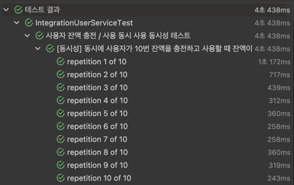
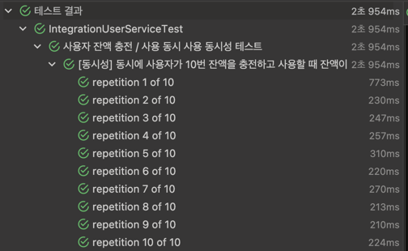
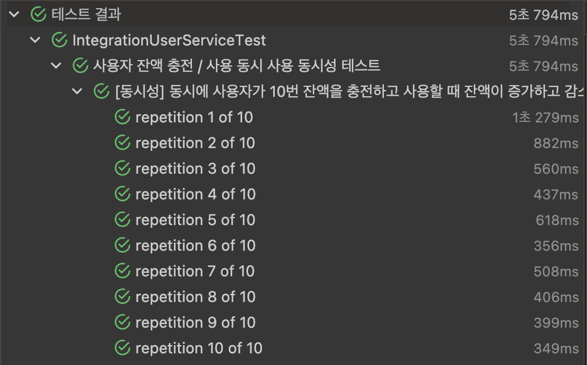
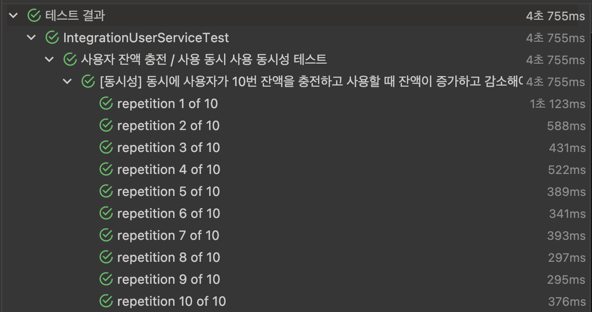
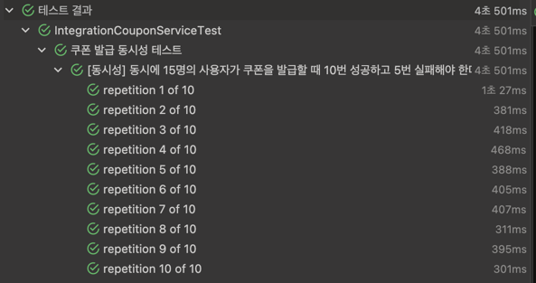
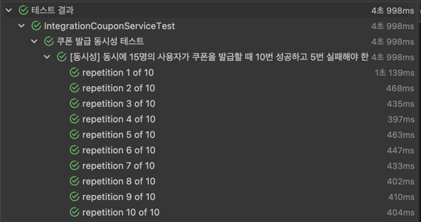
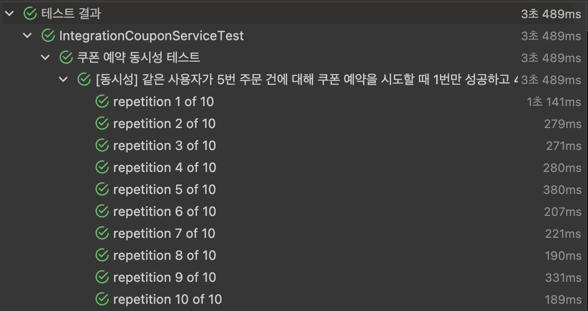
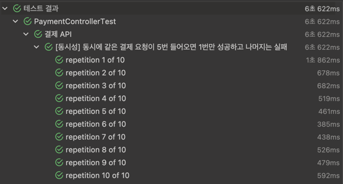
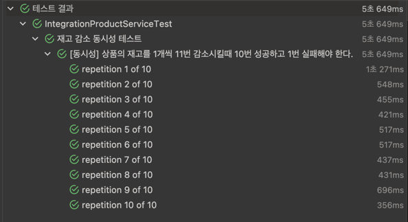

# 프로젝트에서 발생하는 동시성 이슈

## 1. 잔액 충전 / 사용

### 설명

- 프로젝트 내에서 사용자의 충전이나 잔액이 발생하는 경우 동시성 문제가 발생할 수 있습니다.
- 사용자가 동시에 충전을 하거나 사용을 하는 경우는 극히 드물것으로 예상되어 기존에는 낙관적락을 이용하여 처리했습니다.

### 비교

충전과 사용을 동시에 처리하는 경우 각 방식에 따라 시간이 얼마나 걸리는지 체크해보았습니다.

```kotlin
@RepeatedTest(10)
@DisplayName("[동시성] 동시에 사용자가 10번 잔액을 충전하고 사용할 때 잔액이 증가하고 감소해야 한다.")
fun chargeAndUseBalanceConcurrentTest() {
    val chargeAmount = 10000L
    val useAmount = 1000L
    val chargeCommand = ChargeBalanceCommand(1, chargeAmount)
    val useCommand = UseBalanceCommand(1, useAmount)
    val result =
        ConcurrentTestHelper.executeAsyncTasksByMultiTask(10) {
            // 충전
            val isChargeSuccess =
                try {
                    userService.chargeBalance(chargeCommand)
                    true
                } catch (e: Exception) {
                    false
                }
            // 사용
            val isUseSuccess =
                try {
                    userService.useBalance(useCommand)
                    true
                } catch (e: Exception) {
                    false
                }

            isChargeSuccess to isUseSuccess
        }

    val successfulChargeCount = result.count { it.first }
    val successfulUseCount = result.count { it.second }
    val updatedUser = dataJpaUserRepository.findByIdOrNull(1L) ?: throw RuntimeException("User not found")
    val balanceHistories = dataJpaBalanceHistoryRepository.findAll()
    assertThat(updatedUser.balance).isEqualTo(
        defaultBalance + (successfulChargeCount * chargeAmount) - (successfulUseCount * useAmount),
    )
    assertThat(balanceHistories.size).isEqualTo(successfulChargeCount + successfulUseCount)
    assertThat(balanceHistories.count { it.amount == chargeAmount }).isEqualTo(successfulChargeCount)
    assertThat(balanceHistories.count { it.amount == useAmount }).isEqualTo(successfulUseCount)
    assertThat(balanceHistories.all { it.user.id == updatedUser.id }).isTrue()
}
```

#### 비관적락 사용

다음과 같이 사용자를 FOR UPDATE로 조회하여 비관적락을 적용한 후 테스트를 진행했습니다.

```kotlin
interface DataJpaUserRepository : JpaRepository<User, Long> {
    @Lock(LockModeType.PESSIMISTIC_WRITE)
    @Query("SELECT u FROM User u WHERE u.id = :id")
    fun findByIdWithLock(id: Long): User?
}
```

테스트 진행 결과 다음과 같은 시간이 소요되었습니다.



#### 낙관적락 사용

다음과 같이 JPA의 @Version 어노테이션을 사용하여 낙관적락을 적용한 후 테스트를 진행했습니다.

```kotlin
@Entity
@Table(name = "users")
class User(
    ...
    @Version
    @Column(name = "version", nullable = false
)

@Comment("낙관적락을 위한 버전")
val version: Long = 0,
...
)
```

테스트 진행 결과 다음과 같은 시간이 소요되었습니다. (약 3초)


#### named lock 사용

다음과 같이 named lock을 구현한 후 테스트를 진행했습니다.

```kotlin
  @Query("SELECT GET_LOCK(:id, 10)", nativeQuery = true)
fun getLock(id: Long)

@Query("SELECT RELEASE_LOCK(:id)", nativeQuery = true)
fun releaseLock(id: Long)
```



#### 분산락(Redisson) 사용

다음과 같이 Redisson을 사용하여 분산락을 구현한 후 테스트를 진행했습니다.

```kotlin
@Component
class RedissonLockManager(
    private val redissonClient: RedissonClient,
) : LockManager {
    override fun <T> withLock(
        key: String,
        block: () -> T,
    ): T {
        val lock = redissonClient.getLock(key)
        return if (lock.tryLock(5, 10, TimeUnit.SECONDS)) {
            try {
                block()
            } finally {
                lock.unlock()
            }
        } else {
            throw BusinessException(ErrorCode.LOCK_TIMEOUT)
        }
    }
}
```



### 채택한 방법

- 낙관적락 사용
    - 각 사용자마다 충전 / 사용하는 경우가 드물기 때문에 충돌 가능성이 적어 별도의 Lock을 걸지 않는 낙관적락 방식을 사용했습니다.
    - 실패하는 경우 비정상적인 요청일 가능성이 높다고 생각해서 별도의 Retry 로직을 추가하지 않았습니다.
    - 다른 방식에 비해 성능이 더 이점이 많다고 생각하여 낙관적락을 사용했습니다.

## 2. 선착순 쿠폰 발급

### 설명

- 쿠폰 발급시 개수가 한정된 쿠폰에 대해 동시성 문제가 발생할 수 있습니다.
- 선착순 쿠폰의 경우 사용자가 순간적으로 많이 몰릴 수 있으므로 충돌이 많이 발생할 것으로 예상하여 기존에는 비관적락을 사용했습니다.

#### 비관적락

테스트 진행 결과 다음과 같은 시간이 소요되었습니다.


#### Redisson을 이용한 Pub/Sub 분산락 + 낙관적락

테스트 진행 결과 다음과 같은 시간이 소요됐습니다.


### 채택한 방법

- Redisson을 이용한 Pub/Sub 분산락 + 낙관적락
    - 사용자가 순간적으로 많이 몰릴 수 있기 때문에 충돌이 많이 발생하기 때문에 낙관적락은 고려하지 않았습니다.
    - 가장 사용자가 많이 몰릴 수 있는 기능이라고 생각해서 DB의 부하를 줄여주기 위해 Redis를 이용해서 분산락을 채택했습니다.
    - 차후에 서킷브레이커를 통해 레디스에 장애가 발생했을 때 비관적락으로 동작할 수 있도록 구현할 예정입니다.

## 3. 주문시 쿠폰 사용 예약

### 설명

- 주문 시점에 쿠폰을 사용하여 할인 받으려고 하는 경우 중복 사용 처리될 위험이 있기 때문에 Lock이 필요하다고 생각했습니다.
- 같은 유저로 로그인한 후 동시에 주문을 하며, 쿠폰을 사용하는 경우가 극히 드물것으로 생각하여 낙관적락으로 처리했습니다.

### 채택한 방법

- 낙관적 락 사용
    - 포인트 충전 / 사용과 마찬가지로 충돌이 극히 드물것으로 생각해서 낙관적락을 적용했습니다.

## 4. 주문 건에 대한 결제 중복 요청을 막기위한 Lock

### 설명

- 주문 건에 대한 결제 중복 요청 시, 하나의 주문이 여러 번 결제될 수 있습니다.
- 결제가 한번만 되는 것을 보장하면 되기 때문에 비관락으로 다른 요청이 처리되지 못하도록 했습니다.

### 채택한 방법
- 비관적락 사용
  - 비관적락은 트랜잭션이 진행되는 동안 해당 데이터에 대한 수정 접근을 차단하므로 중복 결제 요청을 확실하게 방지할 수 있습니다.
  - 이후의 결제건에 대해서는 처리된 주문인 것을 바로 확인하고 종료하므로 비관적락이 가장 적합한 선택지라고 판단했습니다.

## 5. 재고 수량 변경

### 설명

- 재고 수량 변경시 동시성 문제가 발생할 수 있습니다.
- 재고 감소의 경우 주문건이 늘어나면 늘어날수록 충돌이 많아질 가능성이 높다고 생각해서 비관적락을 채택했습니다.

### 채택한 방법
- 비관적락 사용
  - 재고 수량은 결제건이 늘어날수록 충돌이 많아질 가능성이 높다고 생각해서 비관적락을 채택했습니다.