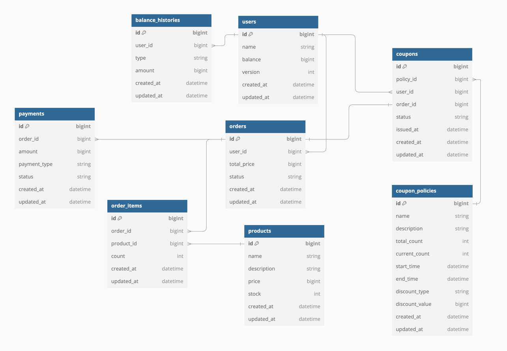

# ERD

## users
- 사용자 정보를 저장하는 테이블
- 이름, 잔액을 저장한다.
- 사용자 별로 관리되므로 충돌이 거의 없을 것으로 예상해 낙관적락을 사용합니다.

## balance_histories
- 사용자의 잔액 변동 이력을 저장하는 테이블
- 사용자의 id, 변경할 잔액, 변경 유형을 저장한다. 
- 변경 유형은 충전, 사용으로 나뉜다.

## products
- 상품 정보를 저장하는 테이블
- 상품의 id, 이름, 가격, 잔여 수량을 저장한다.
- 잔여 수량은 상품이 결제완료될 때마다 감소한다.
- 잔여 수량 감소시 동시성 문제를 회피하기 위해 비관적락을 사용합니다.

## orders
- 주문 정보를 저장하는 테이블
- 사용자 id, 총 주문 금액, 주문 상태를 저장한다.
- 주문 상태는 결제 대기, 결제완료, 주문취소로 나뉜다.

## order_items
- 주문 상품 정보를 저장하는 테이블
- 주문 id, 상품 id, 주문한 상품 수량을 저장한다.

## popular_products
- 최근 3일간 가장 많이 팔린 상품 정보를 저장하는 테이블
- 상품 id, 랭킹, 판매량 정보, 계산 일자를 저장합니다.
- 매일 00시 00분에 스케줄러를 통해 계산된 정보를 저장합니다.

## coupons
- 쿠폰 정보를 저장하는 테이블
- 쿠폰 정책 id, 사용자 id, 주문 id(nullable), 쿠폰 상태, 발행 시간, 만료 시간을 저장한다.

## coupon_policies
- 쿠폰 정책 정보를 저장하는 테이블
- 쿠폰 이름, 쿠폰 설명, 쿠폰 총 개수, 쿠폰 발급 개수, 쿠폰 발급 가능 일자, 쿠폰 발급 만료 일자, 쿠폰 할인 타입, 쿠폰 할인 값을 저장한다.
- 쿠폰 할인 타입은 금액, 비율로 나뉜다.
- 쿠폰 발급 개수는 총 개수를 넘을 수 없습니다.
- 쿠폰 발급 개수는 동시성 문제를 회피하기 위해 비관적락을 사용합니다.

## payments
- 결제 정보를 저장하는 테이블
- 주문 id, 결제 금액, 결제 타입, 결제 상태를 저장한다.
- 결제 타입은 현재 잔액만 존재합니다.
- 결제 상태는 결제 완료, 결제 실패, 결제 취소로 나뉜다.