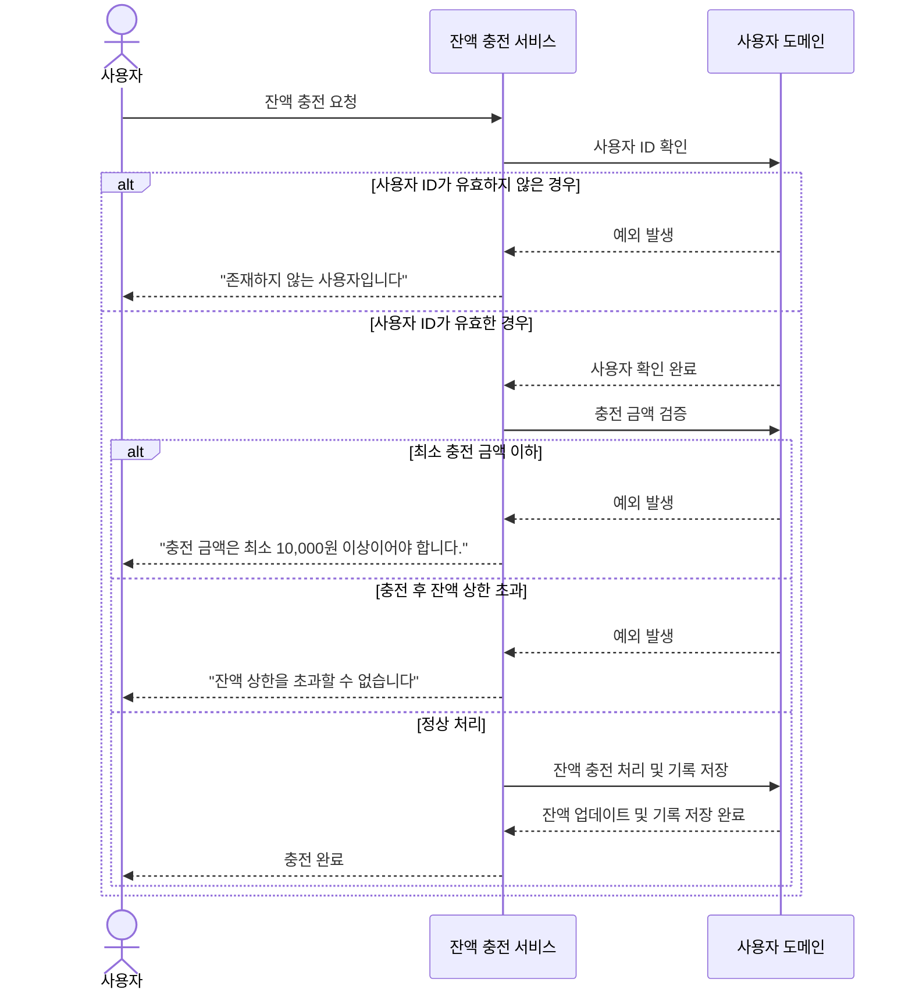
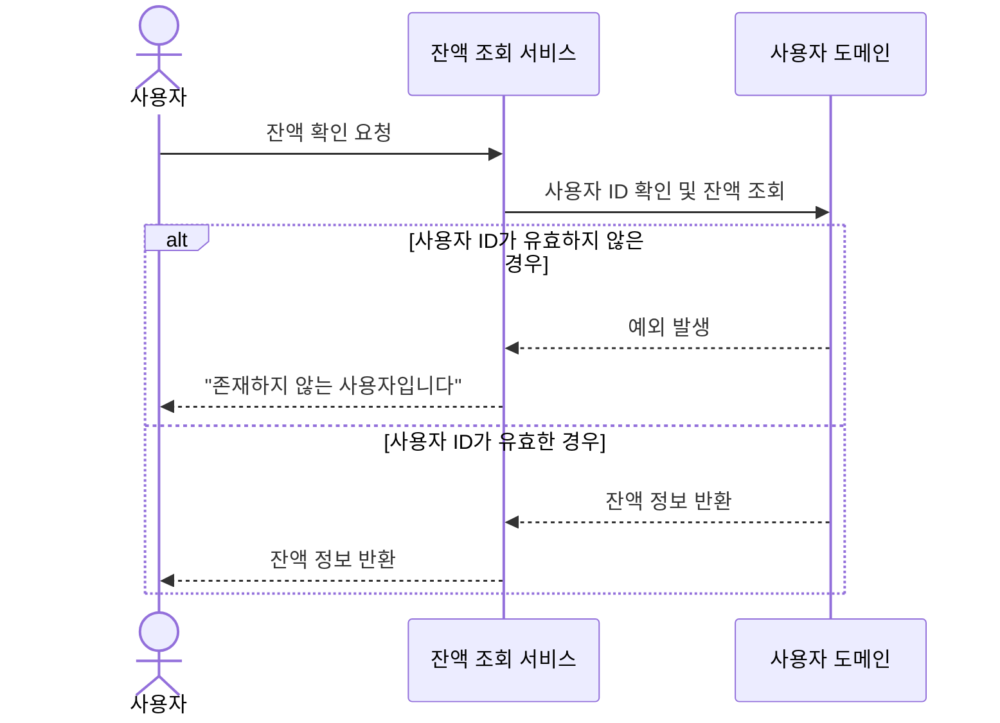
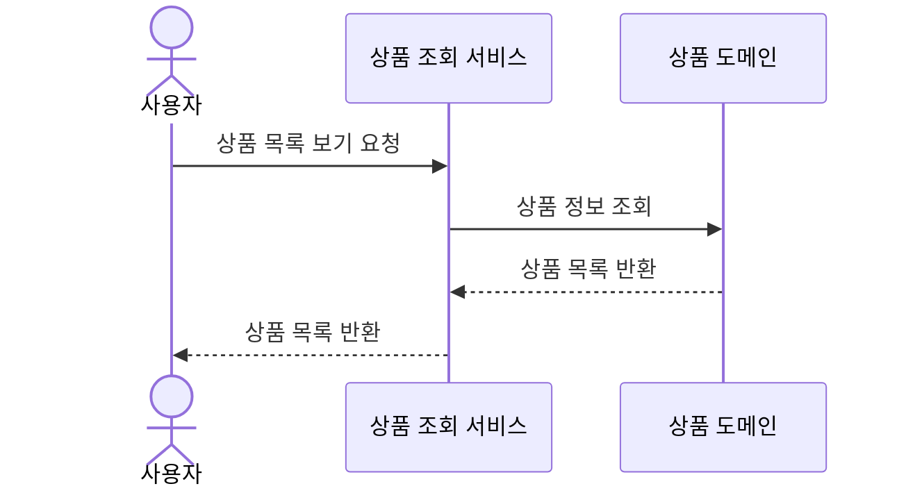
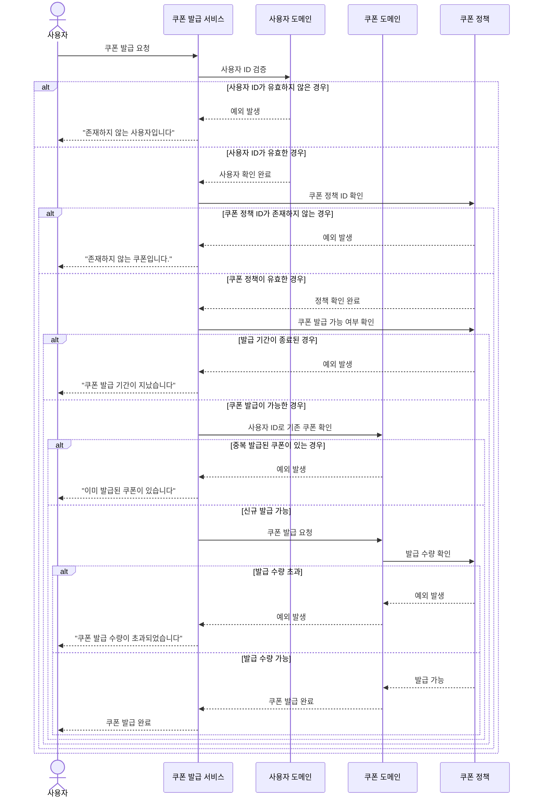
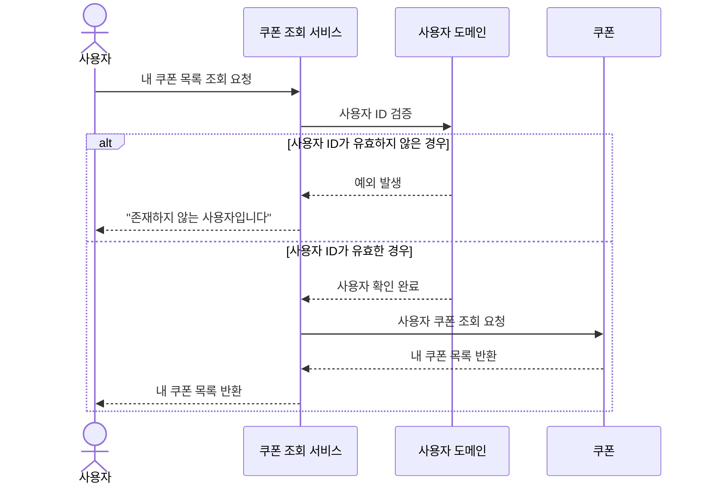
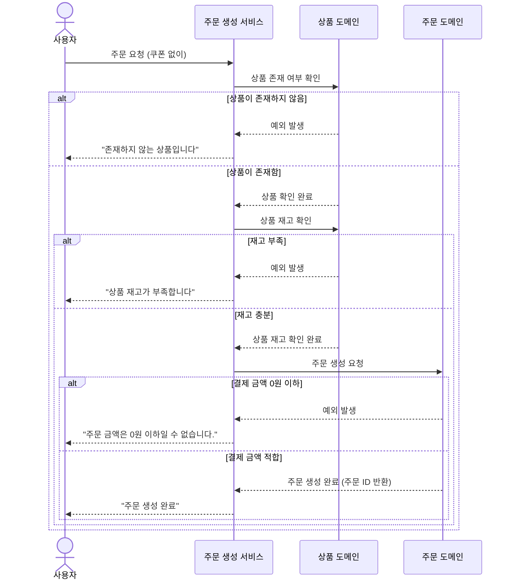
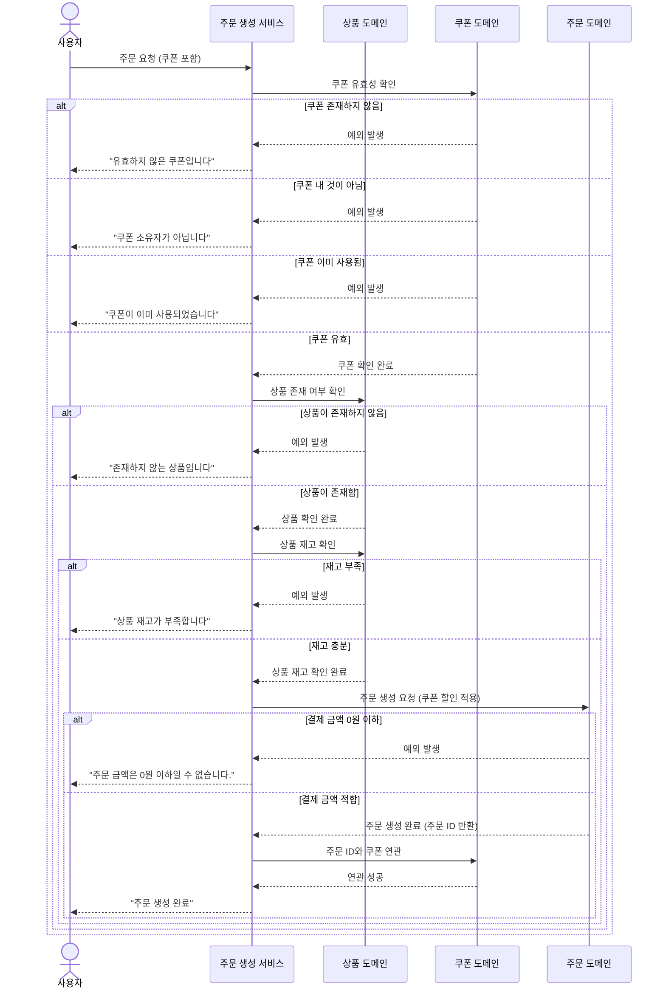
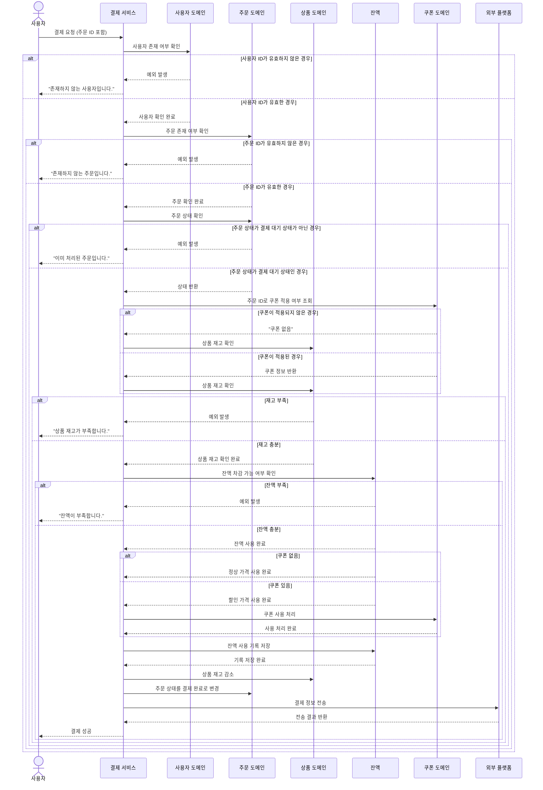
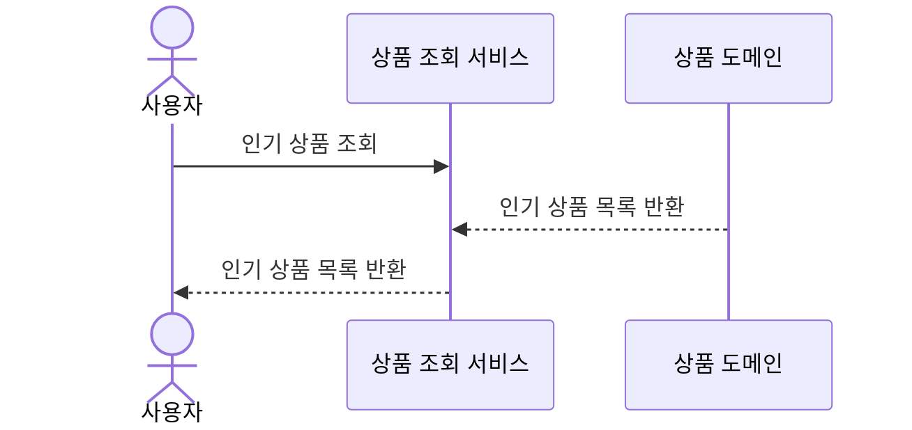
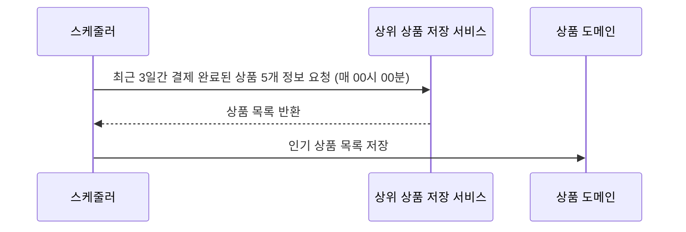

# 시퀀스 다이어그램

## 잔액 충전

```mermaid
sequenceDiagram
    actor User as 사용자
    participant API as 잔액 충전 서비스
    participant UserDomain as 사용자 도메인

    User ->> API: 잔액 충전 요청
    API ->> UserDomain: 사용자 ID 확인
    alt 사용자 ID가 유효하지 않은 경우
        UserDomain -->> API: 예외 발생
        API -->> User: "존재하지 않는 사용자입니다"
    else 사용자 ID가 유효한 경우
        UserDomain -->> API: 사용자 확인 완료
        API ->> UserDomain: 충전 금액 검증
        alt 최소 충전 금액 이하
            UserDomain -->> API: 예외 발생
            API -->> User: "충전 금액은 최소 10,000원 이상이어야 합니다."
        else 충전 후 잔액 상한 초과
            UserDomain -->> API: 예외 발생
            API -->> User: "잔액 상한을 초과할 수 없습니다"
        else 정상 처리
            API ->> UserDomain: 잔액 충전 처리 및 기록 저장
            UserDomain -->> API: 잔액 업데이트 및 기록 저장 완료
            API -->> User: 충전 완료
        end
    end
```

## 잔액 조회

```mermaid
sequenceDiagram
    actor User as 사용자
    participant API as 잔액 조회 서비스
    participant UserDomain as 사용자 도메인

    User ->> API: 잔액 확인 요청
    API ->> UserDomain: 사용자 ID 확인 및 잔액 조회
    alt 사용자 ID가 유효하지 않은 경우
        UserDomain -->> API: 예외 발생
        API -->> User: "존재하지 않는 사용자입니다"
    else 사용자 ID가 유효한 경우
        UserDomain -->> API: 잔액 정보 반환
        API -->> User: 잔액 정보 반환
    end

```

## 상품 조회

```mermaid
sequenceDiagram
    actor User as 사용자
    participant API as 상품 조회 서비스
    participant Product as 상품 도메인
    User ->> API: 상품 목록 보기 요청
    API ->> Product: 상품 정보 조회
    Product -->> API: 상품 목록 반환
    API -->> User: 상품 목록 반환

```

## 쿠폰 발급

```mermaid
sequenceDiagram
    actor User as 사용자
    participant API as 쿠폰 발급 서비스
    participant UserDomain as 사용자 도메인
    participant CouponDomain as 쿠폰 도메인
    participant Policy as 쿠폰 정책

    User ->> API: 쿠폰 발급 요청
    API ->> UserDomain: 사용자 ID 검증
    alt 사용자 ID가 유효하지 않은 경우
        UserDomain -->> API: 예외 발생
        API -->> User: "존재하지 않는 사용자입니다"
    else 사용자 ID가 유효한 경우
        UserDomain -->> API: 사용자 확인 완료
        API ->> Policy: 쿠폰 정책 ID 확인
        alt 쿠폰 정책 ID가 존재하지 않는 경우
            Policy -->> API: 예외 발생
            API -->> User: "존재하지 않는 쿠폰입니다."
        else 쿠폰 정책이 유효한 경우
            Policy -->> API: 정책 확인 완료
            API ->> Policy: 쿠폰 발급 가능 여부 확인
            alt 발급 기간이 종료된 경우
                Policy -->> API: 예외 발생
                API -->> User: "쿠폰 발급 기간이 지났습니다"
            else 쿠폰 발급이 가능한 경우
                API ->> CouponDomain: 사용자 ID로 기존 쿠폰 확인
                alt 중복 발급된 쿠폰이 있는 경우
                    CouponDomain -->> API: 예외 발생
                    API -->> User: "이미 발급된 쿠폰이 있습니다"
                else 신규 발급 가능
                    API ->> CouponDomain: 쿠폰 발급 요청
                    CouponDomain ->> Policy: 발급 수량 확인
                    alt 발급 수량 초과
                        Policy -->> CouponDomain: 예외 발생
                        CouponDomain -->> API: 예외 발생
                        API -->> User: "쿠폰 발급 수량이 초과되었습니다"
                    else 발급 수량 가능
                        Policy -->> CouponDomain: 발급 가능
                        CouponDomain -->> API: 쿠폰 발급 완료
                        API -->> User: 쿠폰 발급 완료
                    end
                end
            end
        end
    end
```

## 내 쿠폰 조회

```mermaid
sequenceDiagram
    actor User as 사용자
    participant API as 쿠폰 조회 서비스
    participant UserDomain as 사용자 도메인
    participant Coupon as 쿠폰

    User ->> API: 내 쿠폰 목록 조회 요청
    API ->> UserDomain: 사용자 ID 검증
    alt 사용자 ID가 유효하지 않은 경우
        UserDomain -->> API: 예외 발생
        API -->> User: "존재하지 않는 사용자입니다"
    else 사용자 ID가 유효한 경우
        UserDomain -->> API: 사용자 확인 완료
        API ->> Coupon: 사용자 쿠폰 조회 요청
        Coupon -->> API: 내 쿠폰 목록 반환
        API -->> User: 내 쿠폰 목록 반환
    end

```

## 주문
- 쿠폰을 적용하지 않은 경우

```mermaid
sequenceDiagram
    actor User as 사용자
    participant OrderAPI as 주문 생성 서비스
    participant Product as 상품 도메인
    participant Order as 주문 도메인

    User ->> OrderAPI: 주문 요청 (쿠폰 없이)
    OrderAPI ->> Product: 상품 존재 여부 확인
    alt 상품이 존재하지 않음
        Product -->> OrderAPI: 예외 발생
        OrderAPI -->> User: "존재하지 않는 상품입니다"
    else 상품이 존재함
        Product -->> OrderAPI: 상품 확인 완료
        OrderAPI ->> Product: 상품 재고 확인
        alt 재고 부족
            Product -->> OrderAPI: 예외 발생
            OrderAPI -->> User: "상품 재고가 부족합니다"
        else 재고 충분
            Product -->> OrderAPI: 상품 재고 확인 완료
            OrderAPI ->> Order: 주문 생성 요청
            alt 결제 금액 0원 이하
                Order -->> OrderAPI: 예외 발생
                OrderAPI -->> User: "주문 금액은 0원 이하일 수 없습니다."
            else 결제 금액 적합
                Order -->> OrderAPI: 주문 생성 완료 (주문 ID 반환)
                OrderAPI -->> User: "주문 생성 완료"
            end
        end
    end

```
- 쿠폰을 적용한 경우

```mermaid
sequenceDiagram
    actor User as 사용자
    participant OrderAPI as 주문 생성 서비스
    participant Product as 상품 도메인
    participant Coupon as 쿠폰 도메인
    participant Order as 주문 도메인

    User ->> OrderAPI: 주문 요청 (쿠폰 포함)
    OrderAPI ->> Coupon: 쿠폰 유효성 확인
    alt 쿠폰 존재하지 않음
        Coupon -->> OrderAPI: 예외 발생
        OrderAPI -->> User: "유효하지 않은 쿠폰입니다"
    else 쿠폰 내 것이 아님
        Coupon -->> OrderAPI: 예외 발생
        OrderAPI -->> User: "쿠폰 소유자가 아닙니다"
    else 쿠폰 이미 사용됨
        Coupon -->> OrderAPI: 예외 발생
        OrderAPI -->> User: "쿠폰이 이미 사용되었습니다"
    else 쿠폰 유효
        Coupon -->> OrderAPI: 쿠폰 확인 완료
        OrderAPI ->> Product: 상품 존재 여부 확인
        alt 상품이 존재하지 않음
            Product -->> OrderAPI: 예외 발생
            OrderAPI -->> User: "존재하지 않는 상품입니다"
        else 상품이 존재함
            Product -->> OrderAPI: 상품 확인 완료
            OrderAPI ->> Product: 상품 재고 확인
            alt 재고 부족
                Product -->> OrderAPI: 예외 발생
                OrderAPI -->> User: "상품 재고가 부족합니다"
            else 재고 충분
                Product -->> OrderAPI: 상품 재고 확인 완료
                OrderAPI ->> Order: 주문 생성 요청 (쿠폰 할인 적용)
                alt 결제 금액 0원 이하
                    Order -->> OrderAPI: 예외 발생
                    OrderAPI -->> User: "주문 금액은 0원 이하일 수 없습니다."
                else 결제 금액 적합
                    Order -->> OrderAPI: 주문 생성 완료 (주문 ID 반환)
                    OrderAPI ->> Coupon: 주문 ID와 쿠폰 연관
                    Coupon -->> OrderAPI: 연관 성공
                    OrderAPI -->> User: "주문 생성 완료"
                end
            end
        end
    end

```

## 결제

```mermaid
sequenceDiagram
    actor User as 사용자
    participant PaymentAPI as 결제 서비스
    participant UserDomain as 사용자 도메인
    participant Order as 주문 도메인
    participant Product as 상품 도메인
    participant Balance as 잔액
    participant Coupon as 쿠폰 도메인
    participant External as 외부 플랫폼

    User ->> PaymentAPI: 결제 요청 (주문 ID 포함)
    PaymentAPI ->> UserDomain: 사용자 존재 여부 확인
    alt 사용자 ID가 유효하지 않은 경우
        UserDomain -->> PaymentAPI: 예외 발생
        PaymentAPI -->> User: "존재하지 않는 사용자입니다."
    else 사용자 ID가 유효한 경우
        UserDomain -->> PaymentAPI: 사용자 확인 완료
        PaymentAPI ->> Order: 주문 존재 여부 확인
        alt 주문 ID가 유효하지 않은 경우
            Order -->> PaymentAPI: 예외 발생
            PaymentAPI -->> User: "존재하지 않는 주문입니다."
        else 주문 ID가 유효한 경우
            Order -->> PaymentAPI: 주문 확인 완료
            PaymentAPI ->> Order: 주문 상태 확인
            alt 주문 상태가 결제 대기 상태가 아닌 경우
                Order -->> PaymentAPI: 예외 발생
                PaymentAPI -->> User: "이미 처리된 주문입니다."
            else 주문 상태가 결제 대기 상태인 경우
                Order -->> PaymentAPI: 상태 반환
                PaymentAPI ->> Coupon: 주문 ID로 쿠폰 적용 여부 조회
                alt 쿠폰이 적용되지 않은 경우
                    Coupon -->> PaymentAPI: "쿠폰 없음"
                    PaymentAPI ->> Product: 상품 재고 확인
                else 쿠폰이 적용된 경우
                    Coupon -->> PaymentAPI: 쿠폰 정보 반환
                    PaymentAPI ->> Product: 상품 재고 확인
                end
                alt 재고 부족
                    Product -->> PaymentAPI: 예외 발생
                    PaymentAPI -->> User: "상품 재고가 부족합니다."
                else 재고 충분
                    Product -->> PaymentAPI: 상품 재고 확인 완료
                    PaymentAPI ->> Balance: 잔액 차감 가능 여부 확인
                    alt 잔액 부족
                        Balance -->> PaymentAPI: 예외 발생
                        PaymentAPI -->> User: "잔액이 부족합니다."
                    else 잔액 충분
                        Balance -->> PaymentAPI: 잔액 사용 완료
                        alt 쿠폰 없음
                            Balance -->> PaymentAPI: 정상 가격 사용 완료
                        else 쿠폰 있음
                            Balance -->> PaymentAPI: 할인 가격 사용 완료
                            PaymentAPI ->> Coupon: 쿠폰 사용 처리
                            Coupon -->> PaymentAPI: 사용 처리 완료
                        end
                        PaymentAPI ->> Balance: 잔액 사용 기록 저장
                        Balance -->> PaymentAPI: 기록 저장 완료
                        PaymentAPI ->> Product: 상품 재고 감소
                        PaymentAPI ->> Order: 주문 상태를 결제 완료로 변경
                        PaymentAPI ->> External: 결제 정보 전송
                        External -->> PaymentAPI: 전송 결과 반환
                        PaymentAPI -->> User: 결제 성공
                    end
                end
            end
        end
    end
```

## 상위 상품 조회

```mermaid
sequenceDiagram
    actor User as 사용자
    participant API as 상품 조회 서비스
    participant Product as 상품 도메인
    User ->> API: 인기 상품 조회
    Product -->> API: 인기 상품 목록 반환
    API -->> User: 인기 상품 목록 반환
```

## 상위 상품 갱신을 위한 스케줄링

```mermaid
sequenceDiagram
    participant Scheduler as 스케줄러
    participant API as 상위 상품 저장 서비스
    participant Product as 상품 도메인
    Scheduler ->> API: 최근 3일간 결제 완료된 상품 5개 정보 요청 (매 00시 00분)
    API -->> Scheduler: 상품 목록 반환
    Scheduler ->> Product: 인기 상품 목록 저장
```