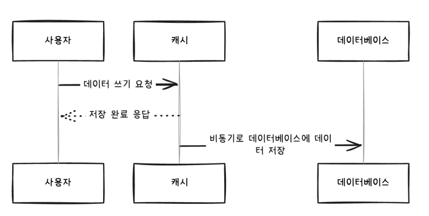

# 캐시

## 캐시(cache)란?

캐시란 데이터의 원본보다 더 빠르고 효율적으로 액세스할 수 있는 임시 데이터 저장소를 의미합니다.

애플리케이션이 다음과 같은 조건을 만족시키는 경우 캐시를 사용했을 때 성능 향상을 기대할 수 있습니다.
- 원본 데이터 저장소에서 원하는 데이터를 찾기 위해 검색하는 시간이 오래 걸리거나, 매번 계산을 통해 데이터를 가져와야 합니다.
- 캐시에서 데이터를 가져오는 것이 원본 데이터 저장소 데이터를 요청하는 것보다 빨라야 합니다.
- 캐시에 저장된 데이터는 잘 변하지 않는 데이터입니다.
- 캐시에 저장된 데이터는 자주 검색되는 데이터입니다.
- 원본 데이터 저장소에서 데이터를 조회하거나 동일한 특정 값을 연산할 때 CPU와 메모리 등의 리소스를 많이 사용합니다.

## 캐시 전략 4가지

### 1. Read Through
클라이언트가 데이터를 요청할 때, 캐시에 해당 데이터가 없으면(캐시 미스) 자동으로 원본 저장소(데이터베이스 등)에서 데이터를 조회한 후 캐시에 저장하고 응답하는 방식입니다.

#### 적합한 상황
- 데이터 접근 빈도가 높지만, 일부 데이터는 변경될 수 있는 경우
  - 자동으로 원본 데이터를 로드하므로, 캐시가 항상 최신 데이터를 반영할 수 있도록 유지할 수 있습니다.
- 개발 복잡도를 낮추고 싶은 경우
  - 애플리케이션 코드 내에서 별도의 캐시 업데이트 로직을 구현할 필요 없이, 캐시 미스 시 자동으로 원본 조회가 이루어지므로 관리가 용이합니다.

### 2. Cache Aside
애플리케이션이 직접 캐시를 관리하며, 캐시에 데이터가 없을 경우 원본 저장소에서 데이터를 가져와 캐시에 저장하는 방식입니다.

#### 적합한 상황
- 데이터 읽기가 많고, 쓰기가 적은 경우
  - 캐시에 저장할 데이터만 필요할 때 조회하여 저장하므로, 메모리 사용을 최적화할 수 있습니다.
- 데이터 일관성을 애플리케이션에서 직접 관리하고 싶은 경우
  - 원본 데이터가 변경될 때 캐시를 명시적으로 삭제해야 하지만, 이를 통해 보다 세밀한 제어가 가능합니다.

### 3. Write Through
데이터를 쓰기 요청할 때, 동시에 캐시와 원본 저장소에 모두 기록하는 방식입니다.

#### 적합한 상황
- 데이터 일관성이 중요한 경우
  - 캐시와 데이터 저장소 사이의 동기화를 보장하므로, 사용자가 항상 최신 데이터를 확인할 수 있습니다.
- 쓰기 부하가 상대적으로 낮은 경우
  - 모든 쓰기 작업에 대해 두 곳에 기록하는 오버헤드를 감수해야하기 때문에 쓰기 부하가 높은 경우에는 적합하지 않습니다.

### 4. Write Behind (Write Back)
데이터를 캐시에 먼저 저장하고, 비동기적으로 데이터베이스에 저장하는 방식입니다.

#### 적합한 상황
- 쓰기 작업이 빈번하지만, 읽기 작업에서는 최신 데이터가 크게 중요하지 않은 경우
  - 매번 캐시를 업데이트하지 않으므로, 캐시 갱신 오버헤드를 줄일 수 있습니다.
- 데이터 저장소의 쓰기 부하를 최소화하고 싶은 경우
  - 여러 번의 변경을 캐시에 모아 한 번에 데이터베이스로 반영할 수 있습니다.

## 캐시 스탬피드 현상 (Cache Stampede)

캐시 스탬피드 현상은 캐시가 만료되거나 적재되지 않은 상태에서 동시에 다수의 요청이 들어와, 모두가 원본 저장소에 접근하게 되는 현상을 말합니다.

이로 인해 원본 시스템에 과도한 부하가 발생할 수 있습니다.

### 대응 방안
- 적절한 만료 시간 설정
  - 캐시의 TTL을 요청 패턴과 부하를 고려하여 적절하게 설정하여 캐시 만료 시점을 너무 자주 갱신이 되지 않도록 합니다.
  - 여러 애플리케이션에서 한꺼번에 접근해야 하는 데이터이며, 반복적으로 사용돼야 하는 데이터라면 저장 시점부터 만료 시간을 충분히 길게 설정해주는 것이 좋습니다.
- 선 계산
  - 캐시가 만료되기 전에 미리 데이터를 계산하여 캐시에 적재해 두는 방식입니다.
  - 주기적인 백그라운드 작업을 통해 데이터를 갱신하면 캐시 스탬피드 현상을 방지할 수 있습니다.
- PER 알고리즘
  - 특정 요청이 들어왔을 때 캐시 만료 시간이 임박한 경우, 백그라운드에서 새로운 값을 미리 로드하는 방식입니다.
- Jitter
  - 만료 시간에 무작위 값을 추가하여 캐시 만료 시간을 분산시켜 동시에 너무 많은 요청이 들어오는 것을 방지하는 방식입니다.
