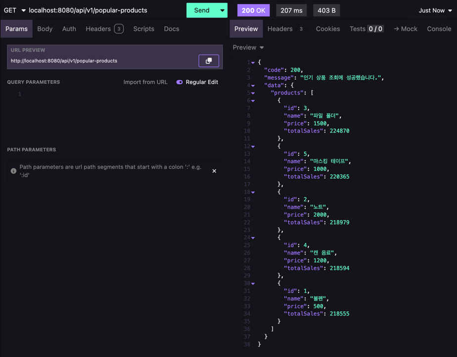
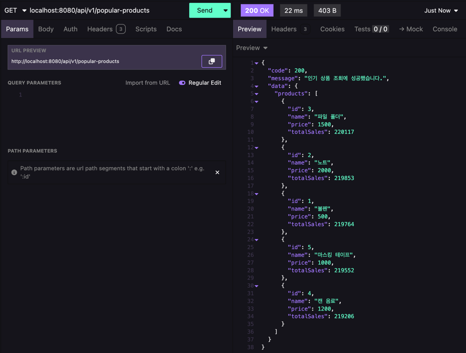

# Redis를 이용한 로직 개선

## 인기 상품 조회 기능 캐싱

### 1. 배경
인기 상품 조회 기능은 사용자가 가장 많은 수량을 구매한 상품을 조회하는 기능입니다.

현재 인기 상품 조회는 DB에서 실시간으로 가장 많은 수량을 구매한 상품 5개를 조회하는 방식으로 구현되어 있습니다.

이로 인해 사용자가 증가할 수록 DB에 부하가 증가할 수 있습니다.

### 2. 기존 로직 문제점 및 해결 방안
기존 로직은 다음과 같은 문제점을 가지고 있습니다.
- 인기 상품 조회 기능은 많은 사용자가 자주 요청할 수 있는 기능있기 때문에 DB에 많은 부하를 줄 수 있습니다.
- 조회할 때마다 주문 완료된 상품의 개수를 계산해야하기 때문에 데이터가 쌓일 수록 조회 속도가 느려질 수 있습니다.
- 인기 상품 조회 기능이 매순간 실시간으로 갱신되어야 하는 것은 아니기 때문에 매번 조회할 필요가 없습니다.

인기 상품 조회 기능은 많은 사용자가 요청할 수 있는 기능이지만 같은 정보를 반복적으로 조회할 가능성이 높기 때문에 캐싱을 통해 문제를 해결할 수 있습니다.
인기상품은 스케줄러를 통해 10분마다 갱신하여 너무 예전의 데이터가 조회되지 않도록 합니다.

### 3. 개선 방법
#### DB에서 조회한 인기 상품 정보를 레디스에 저장하는 방식 **[채택]**
- 레디스에 인기 상품 정보가 없는 경우 DB에서 조회하여 조회한 데이터를 JSON 형태로 레디스에 저장합니다.
- 레디스에 인기 상품 정보가 있는 경우 레디스에서 조회하여 반환합니다.
- 일정 주기마다 DB에서 인기 상품 정보를 조회하여 레디스에 저장하는 스케줄러를 구현합니다.
- 인기 상품 정보는 TTL을 설정하지 않고 저장하여 레디스에 저장된 데이터가 만료되지 않도록 합니다.

구현이 간단하고 기존 방식에 비해 인기 상품 조회를 빠르게 할 수 있어 채택했습니다.

#### Sorted Set을 이용하여 결제가 완료될때마다 판매량을 증가시켜 인기 상품을 조회하는 방식
- 결제 완료시마다 Redis의 Sorted Set을 활용하여 판매량을 누적합니다.
- 인기 상품 조회 시 별도의 DB 조회 없이 Redis의 Sorted Set에서 상위 5개 항목을 가져오도록 변경할 수 있습니다.

해당 방법은 DB를 직접적으로 조회하는 상황을 줄일 수 있을 것으로 예상되지만 다음과 같은 이유로 구현이 복잡해집니다.
1. Redis에 장애가 발생하는 등의 이유로 상품의 판매량 정보가 정확하지 않을 수 있습니다.
2. Redis에 데이터가 없을 때 DB로부터 최신 판매량을 가져와 Redis에 저장하는 과정에 대한 처리가 필요합니다.
3. 주문시 Redis의 판매량 수 증가와 결제 완료 처리에 대한 정합성 보장이 어렵습니다. (Redis와 RDB 간의 데이터 정합성 보장)

위 처럼 고려해야하는 것이 증가하지만 TTL을 이용한 캐싱 방식에 비해 얻는 이점이 크지 않다고 생각하여 TTL을 이용한 캐싱 방식을 채택하였습니다.

다만, 주기적으로 상품 판매량을 DB에 읽어올 필요가 없기 때문에 DB에 가는 요청을 줄일 수 있다는 장점이 있을 것 같습니다.

### 4. 구현 방법

#### TTL을 지정하여 DB에서 조회한 인기 상품 정보를 레디스에 저장하는 방식 **[채택]**
1. API 요청이 들어오면 Redis에서 인기 상품 정보를 조회합니다.
2. Redis에 데이터가 없는 경우 DB에서 인기 상품 데이터를 조회합니다.
3. 조회한 데이터를 Redis에 저장합니다.
4. 이후 동일한 요청이 들어오면 Redis에서 조회하여 반환합니다.
5. 10분 마다 스케줄러를 통해 DB에서 인기 상품 정보를 조회하여 Redis에 저장합니다.

#### Sorted Set을 이용하여 결제가 완료될때마다 판매량을 증가시켜 인기 상품을 조회하는 방식
1. 사용자가 주문을 결제 완료할때마다 Redis의 Sorted Set에 상품 ID와 판매량을 업데이트합니다.
2. 인기 상품 조회시 Redis의 Sorted Set에서 판매량이 높은 상위 5개 상품을 가져옵니다.
3. Redis가 다운되는 경우 DB에서 인기 상품 정보를 조회하여 반환합니다.

### 5. 현재 구현 방식에 발생할 수 있는 문제 및 해결 방안
캐싱을 통해 DB 부하를 줄였지만 Redis에 캐시된 데이터가 존재하지 않는 경우 순간적으로 DB에 많은 요청이 가는 캐시 스탬피드 현상이 발생할 수 있습니다.

이를 해결하기 위해 스케줄러를 통해 TTL보다 짧게 캐시를 반영하여 최신의 데이터를 유지하도록 구현합니다.

스케줄러는 55초마다 DB에 인기상품 정보를 조회하여 Redis에 저장하고 TTL을 1분으로 설정합니다.

### 6. 개선 결과
현재 주문 상품이 DB에 20만건 저장되어 있는 상태에서 인기 상품 조회 API를 호출한 결과입니다.

- 데이터베이스에 직접 조회하는 경우 207ms 만큼의 시간이 소요되었습니다.

- 캐싱을 적용한 이후 응답 속도가 다음과 같이 개선되었습니다.

캐싱을 적용한 결과 응답 속도가 207ms -> 22ms로 약 89.37%의 시간이 단축되었습니다. 

## 쿠폰 발급 로직을 Redis를 이용하도록 개선

### 배경
쿠폰 발급 서비스는 한정된 수량의 쿠폰을 선착순으로 발급하는 서비스입니다.

쿠폰은 요청한 순서대로 순차적으로 발급되어야 하며, 중복 발급을 방지해야 합니다.

현재는 Redis 기반 분산 락을 활용하여 동시성 문제를 해결하고 있습니다.

### 기존 로직 문제점
현재 쿠폰 발급 로직은 Redis의 분산 락을 이용하여 동시성 문제를 해결하고 있지만, 다음과 같은 문제점이 존재합니다.

- 여러 사용자가 동시에 쿠폰을 요청할 경우 락을 획득하는 동안 대기하기 때문에 응답 속도가 느릴 수 있습니다.
- 락을 획득하는 동안 타임아웃이 발생할 수 있으며, 일부 사용자가 쿠폰 발급에 실패할 가능성이 있습니다.

### 개선 방법

#### Redis의 Sorted Set을 이용한 쿠폰 발급 **[채택]**
- Redis의 Sorted Set (ZADD) 을 활용하여 요청 시간을 기준으로 정렬된 큐를 만듭니다.
- ZPOPMIN 명령어를 사용하여 가장 먼저 요청한 사용자부터 쿠폰을 발급합니다.
- 중복 발급 방지를 위해 발급된 사용자 ID를 Set에 저장하여 관리합니다.
 
다음과 같은 이유로 해당 방법을 채택했습니다.
- 요청 시간을 기준으로 정렬하며 먼저 요청한 사용자부터 처리 가능합니다.
- 쿠폰 발급 요청에서 락을 사용하지 않으므로 응답 속도가 빠릅니다.

#### Redis의 INCR / DECR 명령을 이용한 쿠폰 발급
- 쿠폰 수량을 Redis에서 DECR 명령어를 이용해 감소시킵니다.
- 사용자 요청 시 DECR을 실행하여 재고가 남아 있는 경우에만 발급합니다.
- 중복 발급 방지를 위해 Set을 이용하여 발급된 사용자를 저장합니다.

다음과 같은 이유로 해당 방법을 채택하지 않았습니다.
- 중복 체크와 DECR 연산을 원자적으로 처리하기 어렵습니다.
  - 쿠폰 수량 차감과 중복 검사를 원자적으로 실행하는 방법이 복잡합니다. (RDB와 Redis 간의 데이터 정합성 보장)
- 쿠폰 발급 요청이 많아질 경우, DECR 연산이 병목이 될 수 있습니다.
- DECR 연산만으로는 선착순 보장이 어렵습니다.

### 구현 방법
#### Redis의 Sorted Set을 이용한 쿠폰 발급 **[채택]**
1. 사용자가 쿠폰을 요청하면, 요청 시간을 기준으로 Sorted Set에 추가
2. 스케줄러로 일정 주기마다 ZPOPMIN을 이용하여 가장 먼저 요청한 사용자부터 쿠폰 발급
3. 중복 발급 방지를 위해 Redis에 Set을 이용하여 발급한 사용자를 저장

#### Redis의 INCR 명령과 DECR 명령을 이용한 쿠폰 발급
1. 초기에 DB에서 쿠폰 정보를 조회하여 Redis에 쿠폰 수량 및 발급 정보 저장
2. 쿠폰 발급 요청시 DECR 명령을 이용하여 쿠폰 수량을 감소시키고, 중복 발급 여부를 확인

### 현재 구현 방식에 발생할 수 있는 문제 및 해결 방안
- 쿠폰 초과 발급 가능성
  - 쿠폰 발급 수량 만큼 요청받는 식이 아니기 때문에 Sorted Set의 크기를 초과하여 쿠폰이 발급될 수 있습니다.
  - 이를 위해 스케줄러에서 발급 가능 수량만큼만 발급하도록 제한합니다.
- 비동기로 처리하기 때문에 쿠폰 발급 실패시 사용자가 인지하지 못할 수 있음
  - 사용자가 인지 할 수 있도록 해당 유저에게 알림을 보낸다고 가정합니다.
- 레디스에 장애가 발생하는 경우 쿠폰 발급 기능이 중단될 수 있습니다.
  - 레디스가 장애가 발생하는 경우를 대비해 레디스 장애 발생시에는 RDB + 비관락을 통해 문제를 해결합니다.

### 개선 결과

분산락으로 구현했던 방식에서 Sorted Set을 이용한 방식으로 개선하면서 다음과 같은 결과를 얻었습니다.
- 요청을 바로 성공처리 한 후 쿠폰 요청을 Sorted Set에 담은 후 비동기적으로 처리하기 때문에 응답속도가 빠릅니다.
- 쿠폰 발급 요청을 한번에 처리하기 때문에 상대적으로 순간적인 DB에 부하가 적습니다.
