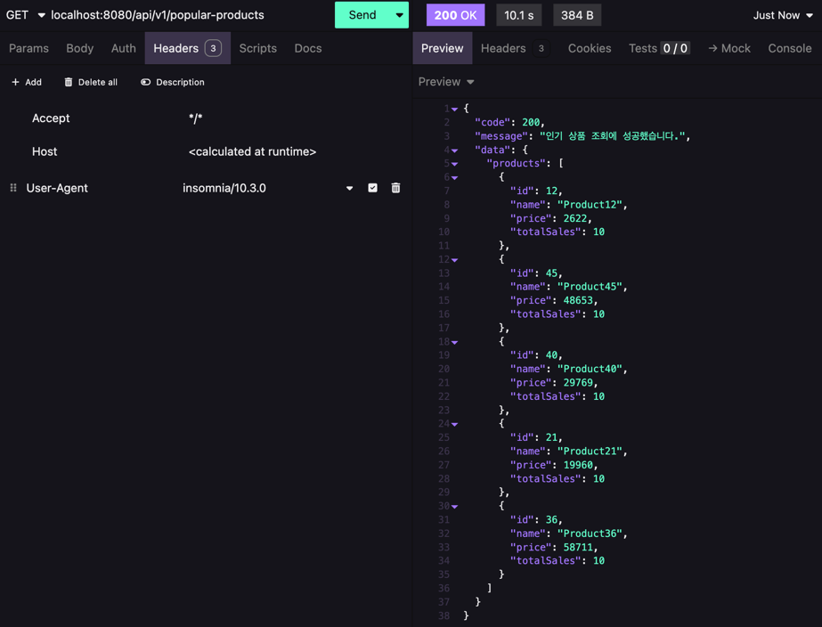
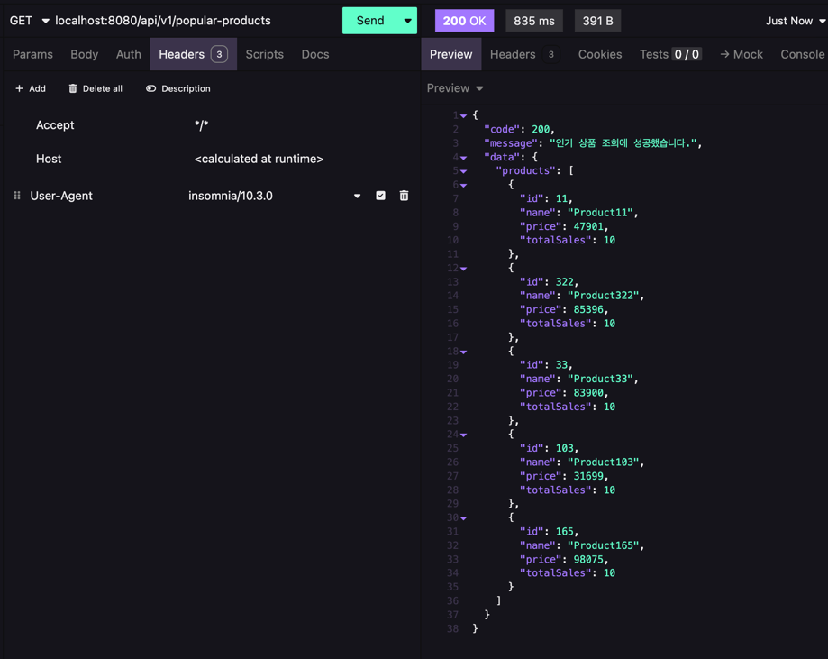

# Index를 통한 성능 개선

## 테스트 데이터베이스

- MySQL 8.0

## 추가한 데이터

- 주문 데이터 50만건
- 주문 상품 데이터 50만건 (1:1 대응)

## 인기 상품 조회 기능 개선

### 1. 인기 상품 조회 기능에 대한 설명

인기 상품 조회 기능은 현재 다음과 같은 기준으로 동작합니다,

- 최근 1일동안 주문 상태가 CONFIRMED인 주문에 포함된 상품들의 주문 수량을 합산하여 가장 많이 주문된 상품 5개를 조회합니다. 

이로 인해 주문건이 쌓일 수록 JOIN 연산이 많아지고, 특히 order_items 테이블의 데이터가 많아질수록 성능이 저하될 수 있습니다.


### 2. 기존 쿼리

인기 상품을 조회하기 위해서 다음과 같은 쿼리를 사용하고 있습니다.

```sql
SELECT p.id,
       p.name,
       p.price,
       SUM(oi.count) AS total_count
FROM products p
       JOIN order_items oi ON p.id = oi.product_id
       JOIN orders o ON oi.order_id = o.id
WHERE o.status = 'CONFIRMED'
  AND o.created_at >= NOW() - INTERVAL 1 DAY
GROUP BY p.id
ORDER BY total_count DESC
LIMIT 5;
```

기존 쿼리에서의 실행 결과는 다음과 같습니다.

인기 상품을 최초 조회시에 10.1초라는 긴 시간이 걸리는 것을 볼 수 있습니다.

#### EXPLAIN 결과

| id | select_type | table | type   | possible_keys | key     | key_len | ref                     | rows   | filtered | Extra                           |
|----|-------------|-------|--------|---------------|---------|---------|-------------------------|--------|----------|---------------------------------|
| 1  | SIMPLE      | oi1_0 | ALL    | NULL          | NULL    | NULL    | NULL                    | 498480 | 100      | Using temporary; Using filesort |
| 1  | SIMPLE      | p1_0  | eq_ref | PRIMARY       | PRIMARY | 8       | hhplus.oi1_0.product_id | 1      | 100      | NULL                            |
| 1  | SIMPLE      | o1_0  | eq_ref | PRIMARY       | PRIMARY | 8       | hhplus.oi1_0.order_id   | 1      | 5        | Using where                     |

- order_items(oi1_0) 테이블이 ALL(Full Table Scan) 수행 중입니다.
    - possible_keys가 NULL → 인덱스를 활용하지 못하고 있습니다.
    - 약 50만 개(498480 rows)를 풀 스캔하고 있습니다.

#### EXPLAIN ANALYZE 결과

```
-> Limit: 5 row(s)  (actual time=4385..4385 rows=5 loops=1)
    -> Sort: total_count DESC, limit input to 5 row(s) per chunk  (actual time=4385..4385 rows=5 loops=1)
        -> Table scan on <temporary>  (actual time=4378..4381 rows=35762 loops=1)
            -> Aggregate using temporary table  (actual time=4378..4378 rows=35762 loops=1)
                -> Nested loop inner join  (cost=937545 rows=24924) (actual time=260..4293 rows=35762 loops=1)
                    -> Nested loop inner join  (cost=389381 rows=498480) (actual time=118..2589 rows=500000 loops=1)
                        -> Table scan on oi1_0  (cost=51739 rows=498480) (actual time=118..1097 rows=500000 loops=1)
                        -> Single-row index lookup on p1_0 using PRIMARY (id=oi1_0.product_id)  (cost=0.577 rows=1) (actual time=0.00281..0.00284 rows=1 loops=500000)
                    -> Filter: ((o1_0.`status` = 'CONFIRMED') and (o1_0.created_at >= <cache>((now() - interval 1 day))))  (cost=1 rows=0.05) (actual time=0.00331..0.00332 rows=0.0715 loops=500000)
                        -> Single-row index lookup on o1_0 using PRIMARY (id=oi1_0.order_id)  (cost=1 rows=1) (actual time=0.00305..0.00307 rows=1 loops=500000)
```

| 항목                                  | 설명                                                                              | 문제점                                  |
|-------------------------------------|---------------------------------------------------------------------------------|--------------------------------------|
| **Limit**                           | 최대 5개 결과 반환                                                                     | 쿼리 실행 시간 4385ms (느림)                 |
| **Sort**                            | SUM(count) DESC 정렬                                                              | 정렬을 위한 추가적인 디스크 I/O 발생               |
| **Table scan on <temporary>**       | 임시 테이블을 사용하여 35,762개 row 처리                                                     | `Using temporary` 발생                 |
| **Aggregate using temporary table** | 임시 테이블에서 SUM(count) 계산                                                          | `Using temporary; Using filesort` 발생 |
| **Nested loop inner join**          | 24,924개 row 대상 조인                                                               | 조인 비용 높음                             |
| **Nested loop inner join**          | 498,480개 row 대상 조인                                                              | 비효율적인 테이블 스캔                         |
| **Table scan on oi1_0**             | Full Scan 발생 (`498,480`개 row)                                                   | 인덱스 최적화 필요                           |
| **Single-row index lookup on p1_0** | `product_id` 기준 인덱스 조회                                                          | 인덱스 활용은 되고 있으나 조인 속도 저하              |
| **Filter**                          | `o1_0.status = 'CONFIRMED'` 및 `o1_0.created_at >= NOW() - INTERVAL 1 DAY` 조건 적용 | 필터링 성능 개선 필요                         |
| **Single-row index lookup on o1_0** | `order_id` 기준 인덱스 조회                                                            | 인덱스 활용은 되고 있으나 성능 개선 가능              |

### 3. 인덱스를 통해 쿼리 개선하기

#### 3.1. order_items 테이블에 order_id, product_id, count 복합 인덱스 추가

```sql
CREATE INDEX idx_order_items_order_id_product_id ON order_items (order_id, product_id, count);
```

- EXPLAIN 결과

| id | select_type | table | type   | possible_keys                       | key                                 | key_len | ref                     | rows   | filtered | Extra                                        |
    |----|-------------|-------|--------|-------------------------------------|-------------------------------------|---------|-------------------------|--------|----------|----------------------------------------------|
| 1  | SIMPLE      | o1_0  | ALL    | PRIMARY                             | NULL                                | NULL    | NULL                    | 497536 | 3.33     | Using where; Using temporary; Using filesort |
| 1  | SIMPLE      | oi1_0 | ref    | idx_order_items_order_id_product_id | idx_order_items_order_id_product_id | 8       | hhplus.o1_0.id          | 1      | 100      | Using index                                  |
| 1  | SIMPLE      | p1_0  | eq_ref | PRIMARY                             | PRIMARY                             | 8       | hhplus.oi1_0.product_id | 1      | 100      | NULL                                         |

- EXPLAIN ANALYZE 결과

```
-> Limit: 5 row(s)  (actual time=799..799 rows=5 loops=1)
    -> Sort: total_count DESC, limit input to 5 row(s) per chunk  (actual time=799..799 rows=5 loops=1)
        -> Table scan on <temporary>  (actual time=792..795 rows=35762 loops=1)
            -> Aggregate using temporary table  (actual time=792..792 rows=35762 loops=1)
                -> Nested loop inner join  (cost=82755 rows=16583) (actual time=6.55..755 rows=35762 loops=1)
                    -> Nested loop inner join  (cost=66273 rows=16583) (actual time=6.3..470 rows=35762 loops=1)
                        -> Filter: ((o1_0.`status` = 'CONFIRMED') and (o1_0.created_at >= <cache>((now() - interval 1 day))))  (cost=48031 rows=16583) (actual time=3.49..232 rows=35762 loops=1)
                            -> Table scan on o1_0  (cost=48031 rows=497536) (actual time=3.39..184 rows=500000 loops=1)
                        -> Covering index lookup on oi1_0 using idx_order_items_order_id_product_id (order_id=o1_0.id)  (cost=1 rows=1) (actual time=0.00621..0.00653 rows=1 loops=35762)
                    -> Single-row index lookup on p1_0 using PRIMARY (id=oi1_0.product_id)  (cost=0.894 rows=1) (actual time=0.00781..0.00783 rows=1 loops=35762)
```

| 항목                                  | 설명                                                                              | 개선된 점                   |
|-------------------------------------|---------------------------------------------------------------------------------|-------------------------|
| **Limit**                           | 최대 5개 결과 반환                                                                     | 쿼리 실행 시간 799ms (대폭 개선됨) |
| **Sort**                            | SUM(count) DESC 정렬                                                              | 정렬 성능 최적화               |
| **Table scan on <temporary>**       | 임시 테이블을 사용하여 35,762개 row 처리                                                     | `Using temporary` 감소    |
| **Aggregate using temporary table** | 임시 테이블에서 SUM(count) 계산                                                          | `Using temporary` 최적화   |
| **Nested loop inner join**          | 16,583개 row 대상 조인                                                               | 조인 성능 대폭 개선             |
| **Nested loop inner join**          | 16,583개 row 대상 조인                                                               | 조인 비용 낮아짐               |
| **Filter**                          | `o1_0.status = 'CONFIRMED'` 및 `o1_0.created_at >= NOW() - INTERVAL 1 DAY` 조건 적용 | 필터링 성능 대폭 개선            |
| **Table scan on o1_0**              | Full Scan 발생 (`497,536`개 row)                                                   | `Using index` 최적화 필요    |
| **Covering index lookup on oi1_0**  | `order_id` 기반으로 커버링 인덱스 조회                                                      | 인덱스 활용으로 성능 향상          |
| **Single-row index lookup on p1_0** | `product_id` 기준 인덱스 조회                                                          | 인덱스 활용                  |

#### 3.2. orders 테이블에 status, created_at 복합 인덱스 추가

```sql
CREATE INDEX idx_order_status_created_at ON orders (status, created_at);
```

- EXPLAIN 결과

  | id | select_type | table | type   | possible_keys                        | key                                 | key_len | ref                     | rows  | filtered | Extra                                                     |
    |----|-------------|-------|--------|--------------------------------------|-------------------------------------|---------|-------------------------|-------|----------|-----------------------------------------------------------|
  | 1  | SIMPLE      | o1_0  | range  | PRIMARY, idx_order_status_created_at | idx_order_status_created_at         | 87      | NULL                    | 68832 | 100      | Using where; Using index; Using temporary; Using filesort |
  | 1  | SIMPLE      | oi1_0 | ref    | idx_order_items_order_id_product_id  | idx_order_items_order_id_product_id | 8       | hhplus.o1_0.id          | 1     | 100      | Using index                                               |
  | 1  | SIMPLE      | p1_0  | eq_ref | PRIMARY                              | PRIMARY                             | 8       | hhplus.oi1_0.product_id | 1     | 100      | NULL                                                      |


- EXPLAIN ANALYZE 결과

```
-> Limit: 5 row(s)  (actual time=721..721 rows=5 loops=1)
    -> Sort: total_count DESC, limit input to 5 row(s) per chunk  (actual time=721..721 rows=5 loops=1)
        -> Table scan on <temporary>  (actual time=714..717 rows=35762 loops=1)
            -> Aggregate using temporary table  (actual time=714..714 rows=35762 loops=1)
                -> Nested loop inner join  (cost=157933 rows=68832) (actual time=0.806..674 rows=35762 loops=1)
                    -> Nested loop inner join  (cost=90274 rows=68832) (actual time=0.575..343 rows=35762 loops=1)
                        -> Filter: ((o1_0.`status` = 'CONFIRMED') and (o1_0.created_at >= <cache>((now() - interval 1 day))))  (cost=14559 rows=68832) (actual time=0.292..32.3 rows=35762 loops=1)
                            -> Covering index range scan on o1_0 using idx_order_status_created_at over (status = 'CONFIRMED' AND '2025-02-12 16:55:57' <= created_at)  (cost=14559 rows=68832) (actual time=0.276..20.7 rows=35762 loops=1)
                        -> Covering index lookup on oi1_0 using idx_order_items_order_id_product_id (order_id=o1_0.id)  (cost=1 rows=1) (actual time=0.00805..0.0085 rows=1 loops=35762)
                    -> Single-row index lookup on p1_0 using PRIMARY (id=oi1_0.product_id)  (cost=0.883 rows=1) (actual time=0.00908..0.00911 rows=1 loops=35762)
```

| 단계                                                                                | 설명                                                                         | 실행 시간 및 행 개수                                                            | 주요 개선점                                                 |
|-----------------------------------------------------------------------------------|----------------------------------------------------------------------------|-------------------------------------------------------------------------|--------------------------------------------------------|
| **Limit**                                                                         | 최대 5개 결과 반환                                                                | `actual time=721..721 rows=5 loops=1`                                   | ✅ 실행 시간 **721ms**로 개선됨 (기존 799ms)                      |
| **Sort**                                                                          | SUM(count) DESC 정렬                                                         | `actual time=721..721 rows=5 loops=1`                                   | ✅ 정렬 속도 개선됨                                            |
| **Table scan on <temporary>**                                                     | 임시 테이블을 사용하여 35,762개 row 처리                                                | `actual time=714..717 rows=35762 loops=1`                               | ✅ `Using temporary` 최적화됨                               |
| **Aggregate using temporary table**                                               | 임시 테이블에서 SUM(count) 계산                                                     | `actual time=714..714 rows=35762 loops=1`                               | ✅ 집계 성능 향상                                             |
| **Nested loop inner join**                                                        | 68,832개 row 대상 조인                                                          | `cost=157933 rows=68832`                                                | ✅ `JOIN` 성능 개선됨                                        |
| **Nested loop inner join**                                                        | 68,832개 row 대상 조인                                                          | `cost=90274 rows=68832`                                                 | ✅ `JOIN` 성능 개선됨                                        |
| **Filter (`o1_0.status = 'CONFIRMED' AND created_at >= NOW() - INTERVAL 1 DAY`)** | `status` 및 `created_at` 조건 필터링                                             | `cost=14559 rows=68832` → `actual time=0.292..32.3 rows=35762 loops=1`  | ✅ **필터링된 row 개수가 기존보다 절반으로 감소**                        |
| **Covering index range scan on o1_0**                                             | `idx_order_status_created_at`을 활용한 `status=CONFIRMED` 및 `created_at` 조건 검색 | `cost=14559 rows=68832` → `actual time=0.276..20.7 rows=35762 loops=1`  | ✅ **인덱스 기반 범위 스캔(`range scan`) 적용됨 → `Table Scan` 제거** |
| **Covering index lookup on oi1_0**                                                | `idx_order_items_order_id_product_id` 인덱스를 사용한 `order_id` 기반 조회            | `cost=1 rows=1` → `actual time=0.00805..0.0085 rows=1 loops=35762`      | ✅ **조인 성능 대폭 개선**                                      |
| **Single-row index lookup on p1_0**                                               | `PRIMARY KEY`를 사용한 `product_id` 조회                                         | `cost=0.883 rows=1` → `actual time=0.00908..0.00911 rows=1 loops=35762` | ✅ 단건 `index lookup` 수행으로 최적화                           |

### 4. Index를 통한 성능 개선 결과

다음과 같이 변경 후 쿼리가 다음과 같이 개선된 것을 볼수 있습니다.


API 요청시 1.1s → 835ms로 쿼리 성능이 개선되었습니다.

기존에 비해 약 **84%** 개선되었습니다.
