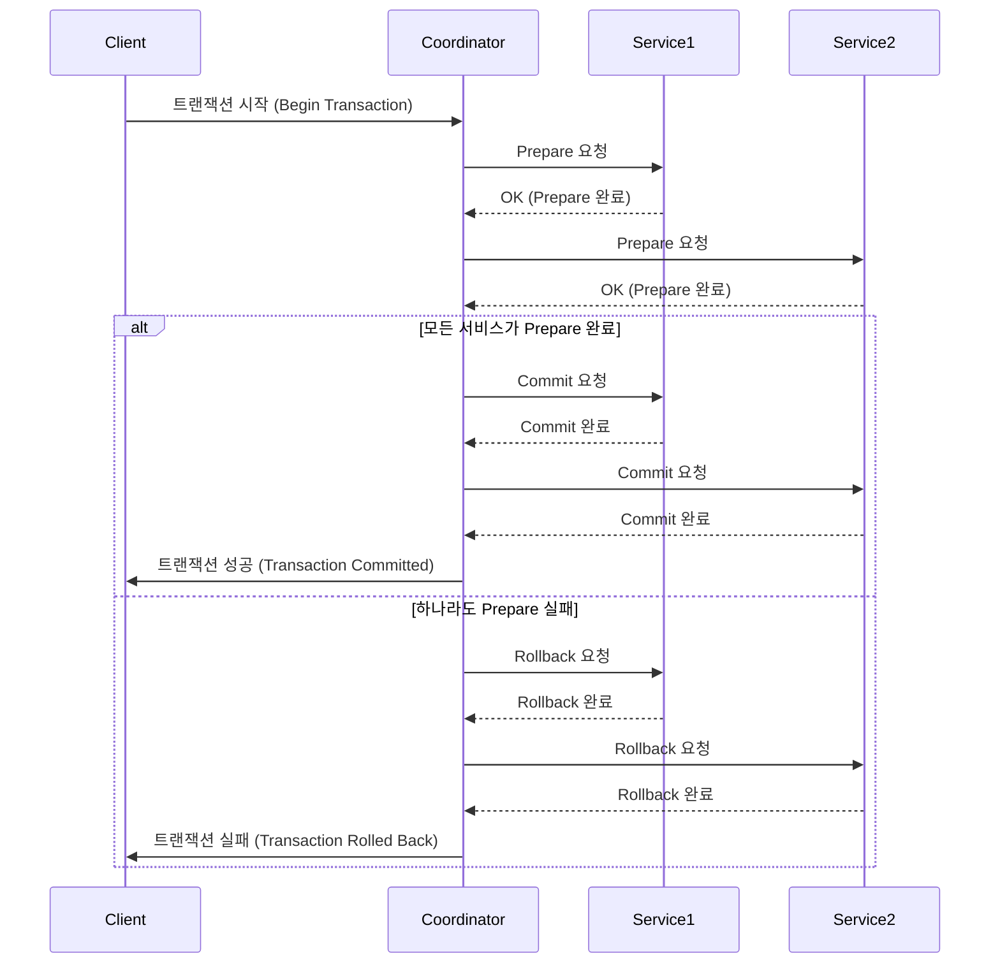
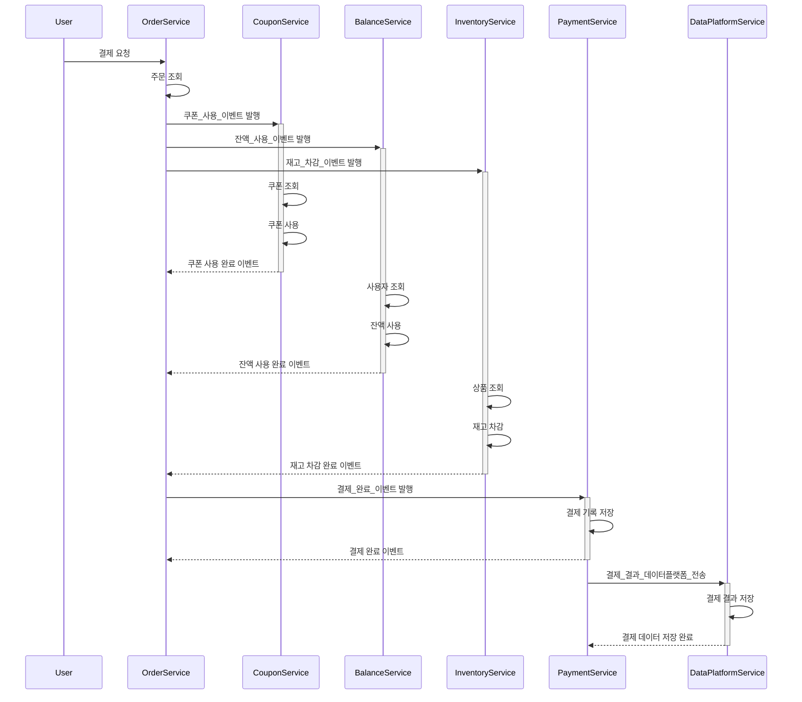
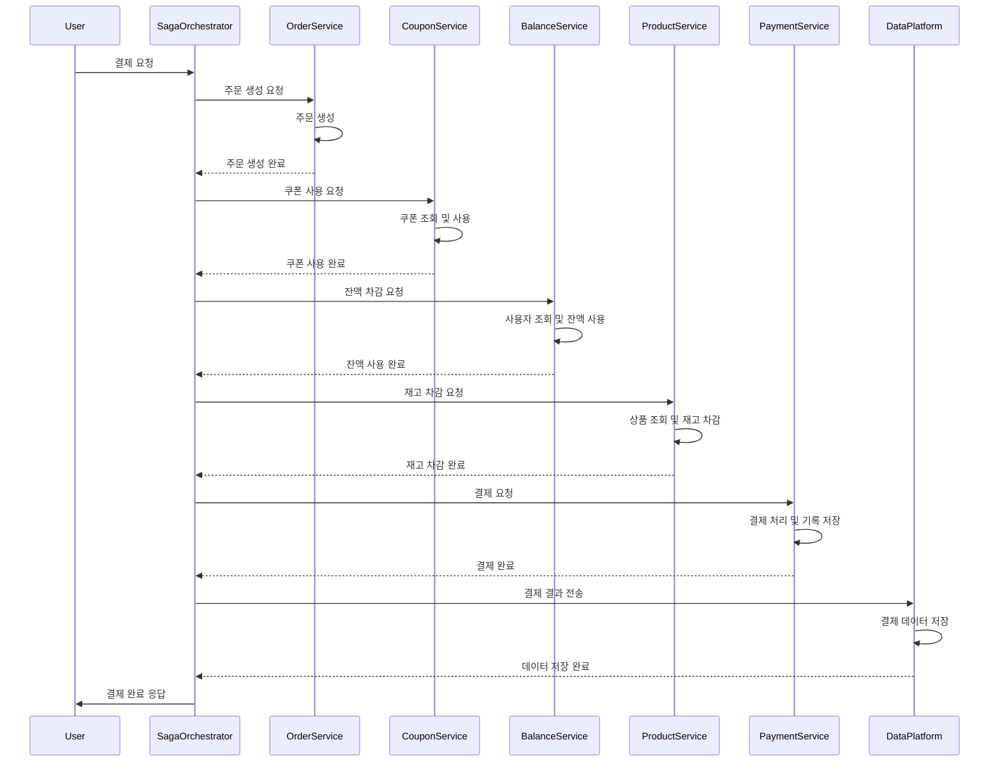

# 서비스 규모에 따른 트랜잭션 처리 한계와 해결 방안에 대한 보고서

## 이벤트를 통한 트랜잭션 분리

이벤트 기반을 통해 트랜잭션을 분리하여 서비스의 규모가 커질 때 발생할 수 있는 문제점을 해결할 수 있습니다.

### 기존 결제 로직의 문제점

```kotlin
@Transactional
fun pay(...) {
    주문_조회(...)
    쿠폰_조회(...)
    쿠폰_사용(...)
    잔액_사용(...)
    재고_차감(...)
    주문_결제_완료_처리(...)
    결제_완료_처리(...)
    결제_결과_데이터플랫폼_전송(...)
}
```

기존 로직은 위와 같이 하나의 트랜잭션으로 처리됩니다.

결제 결과 데이터 플랫폼 전송은 단순히 결제 결과 기록을 전송하는 것이기 때문에 에러가 발생하더라도 결제 처리에는 영향을 주지 않아야 합니다.
하지만 하나의 트랜잭션으로 묶이게 되면서 결제 결과 데이터 플랫폼에 전송하는 과정에서 실패하는 경우 결제 처리가 롤백되게 되는 문제가 발생합니다.

이외에도 다음과 같은 문제들이 발생할 수 있습니다.

- 여러 개의 프로세스를 하나의 트랜잭션에서 처리하면 트랜잭션 유지 시간이 길어지고, 데이터베이스 락이 오래 걸릴 수 있습니다.
- 하나의 서비스가 모든 처리를 담당하면 트래픽 증가 시 부하를 감당하기 어려워집니다.

### 기존 결제 로직 개선

```kotlin
@Transactional
fun pay(...) {
    주문_조회(...)
    쿠폰_조회(...)
    쿠폰_사용(...)
    잔액_사용(...)
    재고_차감(...)
    주문_완료_처리(...)
    결제_완료_처리(...)

    결제_완료_이벤트_발생(...)
}
```

결제 완료 이벤트를 별도로 처리하면서 기존 트랜잭션과 분리하면서 결제 결과 데이터 플랫폼 전송에 대한 실패가 발생하더라도 결제 처리에는 영향을 주지 않게 됩니다.

이벤트는 다음과 같이 이벤트 핸들러를 통해 처리합니다.

```kotlin
@Async
@TransactionalEventListener(phase = TransactionPhase.AFTER_COMMIT)
fun 결제_완료_이벤트(...) {
    결제_결과_데이터플랫폼_전송(...)
}
```

위와 같이 이벤트 기반으로 변경하면서 다음과 같은 이점을 얻을 수 있습니다.

- 핵심 트랜잭션(결제 처리)과 부가적인 작업(데이터 플랫폼 전송)을 분리하여 독립적으로 처리할 수 있습니다.
- 이벤트를 활용하여 여러 개의 마이크로서비스가 독립적으로 동작할 수 있습니다.
- 트랜잭션 유지 시간이 줄어들어 DB 락 경합이 감소하고 응답 속도가 빨라집니다.

추가적으로 재고 차감이나 잔액 사용 등을 별도의 이벤트로 처리하여 도메인간의 의존성을 줄일 수 있습니다.
```kotlin
fun 결제(...) {
    주문_조회(...)
    쿠폰_사용_이벤트(...)
    잔액_사용_이벤트(...)
    재고_차감_이벤트(...)
    결제_완료_이벤트(...)
    결제_기록_저장(...)
}

@Async
@TransactionalEventListener(phase = TransactionPhase.AFTER_COMMIT)
fun 쿠폰_사용_이벤트(...) {
    쿠폰_조회(...)
    쿠폰_사용(...)
}

@Async
@TransactionalEventListener(phase = TransactionPhase.AFTER_COMMIT)
fun 잔액_사용_이벤트(...) {
    사용자_조회(...)
    잔액_사용(...)
}
@Async
@TransactionalEventListener(phase = TransactionPhase.AFTER_COMMIT)
fun 결제_완료_이벤트(...) {
    결제_결과_데이터플랫폼_전송(...)
}

@Async
@TransactionalEventListener(phase = TransactionPhase.AFTER_COMMIT)
fun 재고_차감_이벤트(...) {
    상품_조회(...)
    재고_차감(...)
}
```

## 서비스의 규모가 확장되어 MSA 형태로 도메인별로 배포단위를 분리해야 할 때

### 2PC(2 Phase Commit)

2PC(2 Phase Commit)은 분산 환경에서 여러 데이터베이스 트랜잭션을 원자적으로 처리하기 위한 방법입니다.
코디네이터와 여러 데이터베이스 간의 합의를 통해 트랜잭션을 처리합니다.

1. Prepare 단계
    - 모든 참여 노드(서비스 또는 DB)에 트랜잭션 준비를 요청합니다.
2. Commit 단계
    - 모든 노드가 준비되었다면 최종적으로 커밋을 수행합니다. 하나라도 실패하면 전체 롤백됩니다.


- 2PC의 장점
    - 모든 참여 노드가 동기적으로 트랜잭션을 수행하므로 데이터 일관성을 보장할 수 있습니다.
    - 트랜잭션 원자성을 유지할 수 있습니다.

- 2PC의 단점
    - 트랜잭션이 완료될 때까지 모든 노드가 응답을 기다려야 하므로 지연 시간이 증가할 수 있습니다.
    - 추가적인 코디네이터 역할이 필요하며 장애 발생 시 복구가 어려울 수 있습니다.

### 사가 패턴

사가(Saga) 패턴은 MSA 환경에서 분산 트랜잭션을 관리하는 방법 중 하나로, 보상 트랜잭션을 활용하여 트랜잭션을 처리합니다.

사가 패턴은 크게 코레오그라피 사가(Choreography Saga) 와 오케스트레이션 사가(Orchestration Saga) 두 가지 방식으로 나눌 수 있다.

#### 코레오그라피 사가 (Choreography Saga)
코레오그라피 사가는 마이크로서비스 간의 이벤트 기반 트랜잭션 처리 방식으로, 서비스들이 중앙 조정자 없이 독립적으로 이벤트를 발행하고 구독하여 트랜잭션을 진행한다.

1. 각 서비스는 특정 이벤트를 구독(Subscribe) 하여 자신의 트랜잭션을 수행한 한다.
2. 다음 서비스가 처리할 이벤트를 발행(Publish) 하면서 트랜잭션을 연쇄적으로 진행한다.
3. 실패 시 보상 트랜잭션(Compensating Transaction)을 실행하여 롤백을 수행한다.


- 장점
  - 각 서비스가 독립적으로 트랜잭션을 수행하므로 서비스 간 의존성이 줄어들고, 서비스 확장이 용이하다.
  - 비동기 이벤트 처리 방식을 사용하므로 성능이 향상될 수 있다.
- 단점
  - 트랜잭션 추적이 어려워 디버깅이 어려울 수 있다.
  - 이벤트 순서 보장이 어렵습니다.
  - 중간에 실패 발생시 보상 트랜잭션을 통한 롤백 처리가 필요하기 때문에 복잡성이 증가합니다.

#### 오케스트레이션 사가 (Orchestration Saga)
오케스트레이션 사가는 중앙 컨트롤러 역할을 하는 Saga Orchestrator가 모든 서비스의 트랜잭션을 조율하는 방식이다.
각 서비스는 Saga Orchestrator의 명령에 따라 트랜잭션을 수행하며, 실패 시 Orchestrator가 보상 트랜잭션을 실행하여 데이터 정합성을 유지한다.



- 장점
  - 중앙에서 관리하므로 디버깅과 모니터링이 용이하다.
  - 순차적으로 실행하는 것을 보장할 수 있습니다.
  - 실패시 오케스트레이터가 직접 롤백 처리기 때문에 쉽게 롤백 처리 가능합니다.
- 단점
  - 오케스트레이터가 단일 장애지점이 될 수 있습니다.
  - 모든 서비스 호출시 오케스트레이터를 거치므로 부하가 집중됩니다.
  - 서비스 간 의존성이 높아질 수 있습니다.