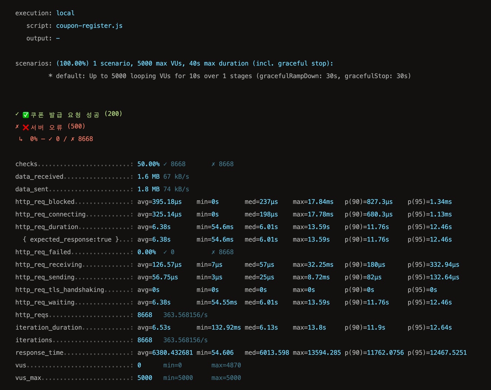

# 📌 부하 테스트 계획 (쿠폰 발급 API)

## **1. API 설명**

- `POST /api/v1/users/{userId}/coupons` 를 호출하여 쿠폰 발급 요청을 할 수 있습니다.
    - `{userId}`에 해당하는 사용자에게 쿠폰 발급 요청을 합니다.
    - API 호출 시 **Authorization 헤더**에 `userId` 정보를 포함해야 합니다.
    - 쿠폰 요청은 **Redis Sorted Set**을 활용하여 저장되며, 스케줄러를 통해 실제 발급이 진행됩니다.

---

## **2. 테스트 가정 (Traffic Assumption)**

### **📊 사용자 트래픽 가정**

| 항목                  | 수치       | 설명                   |
|---------------------|----------|----------------------|
| **MAU** (월간 활성 사용자) | 50만 명    | 부하 테스트 규모에 맞춘 MAU 설정 |
| **DAU** (일간 활성 사용자) | 5만 명     | MAU의 10%             |
| **이벤트 순간 동시 접속자**   | DAU의 10% | 부하 테스트 기준 (5,000명)   |

### **🚀 예상되는 부하**

- **10초 동안 5,000명 요청 (DAU의 10%)**
- **쿠폰 발급 API 트래픽 집중**
- **Redis 및 DB 부하 증가 예상**

---

## **3. 테스트 환경 (Test Environment)**

### **🖥️ 서버 스펙**

| 항목            | 버전                |
|---------------|-------------------|
| **언어**        | Kotlin 2.1        |
| **프레임워크**     | Spring Boot 3.4.1 |
| **데이터베이스**    | MySQL 8.0         |
| **캐시**        | Redis 7.4         |
| **부하 테스트 도구** | K6                |

---

## **4. 테스트 목표 (Test Objectives)**

1. **최대 트래픽 처리 가능 여부 검증**

- **10초 동안 5,000명 동시 요청** 시 API가 정상적으로 동작하는지 확인합니다.

2. **Redis 및 DB 성능 평가**

- **Redis Sorted Set**을 활용한 쿠폰 발급 요청 처리 속도 분석합니다.

3. **API 응답 속도 및 오류율 분석**

- 요청 실패율 (`5xx`, `4xx` 오류) **3% 이하 유지** 목표입니다.

### 5. 테스트 스크립트

```js
import http from 'k6/http';
import {check, sleep} from 'k6';
import {Trend} from 'k6/metrics';

export let responseTime = new Trend('response_time');

export let options = {
    stages: [
        {duration: '10s', target: 5000},
    ],
};

export default function () {
    let userId = Math.floor(Math.random() * 1000000) + 1;  // 1~100만 유저 랜덤 선택
    let url = `http://localhost:8080/api/v1/users/${userId}/coupons`;

    let params = {
        headers: {
            'Authorization': `${userId}`,
            'Content-Type': 'application/json'
        },
    };

    let payload = JSON.stringify({
        couponPolicyId: 1
    });

    let res = http.post(url, payload, params);

    responseTime.add(res.timings.duration);
    check(res, {
        '✅ 쿠폰 발급 요청 성공 (200)': (r) => r.status === 200,
        '❌ 서버 오류 (500)': (r) => r.status === 500,
    });

    sleep(Math.random() * 0.3);
}

```

### 6. 테스트 결과

